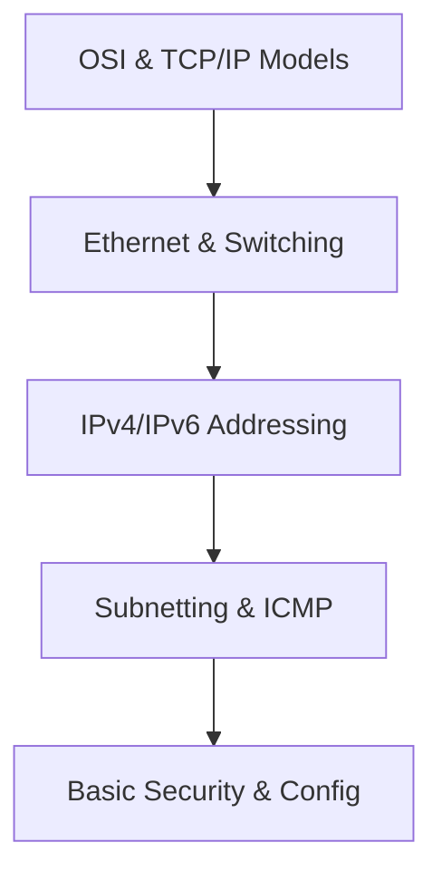
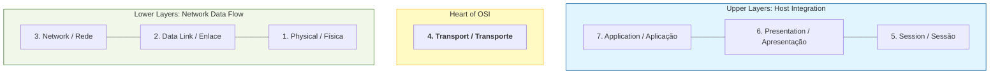

# 🌐 Cisco CCNA v7 Journey | Jornada CCNA

**English:** This repository documents my progress through the Cisco CCNA v7 certification, focusing on "Introduction to Networks" (ITN). It includes lab notes, Packet Tracer files, and network automation scripts as part of my professional roadmap for 2027.  

**Português:** Este repositório documenta meu progresso na certificação Cisco CCNA v7, com foco em "Introdução a Redes" (ITN). Inclui notas de laboratório, arquivos do Packet Tracer e scripts de automação como parte do meu roadmap profissional para 2027.

---

## 🗺️ Study Roadmap | Roteiro de Estudos

**EN:** Organized following the official Cisco Networking Academy curriculum.  
**PT:** Organizado seguindo o currículo oficial da Cisco Networking Academy.

📂 Repository Structure | Estrutura do Repositório

    /labs: * EN: Cisco Packet Tracer (.pkt) files and topology images.

        PT: Arquivos do Packet Tracer e imagens de topologia.

    /notes: * EN: Summary of networking concepts and CLI commands.

        PT: Resumo de conceitos de rede e comandos CLI.

    /automation: * EN: Python scripts for network configuration and automation.

        PT: Scripts Python para configuração e automação de rede.

📚 Technical Summary: OSI Model | Resumo Técnico: Modelo OSI

    
🚀 Professional Goals | Objetivos Profissionais

    [ ] Complete Module 1: Introduction to Networks (ITN)

    [ ] Implement Network Automation scripts with Python

    [ ] Prepare for International IT Market (Japan 2027)
