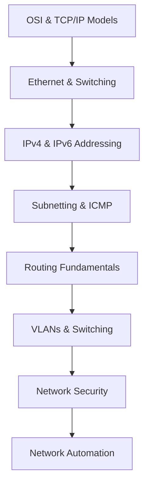

# 🚀 Infrastructure, Networking & DevOps Labs


---

# 📖 About | Sobre

### 🇺🇸 English

This repository contains hands-on labs, study notes, automation scripts, and infrastructure projects focused on networking, Linux systems, and DevOps practices.

The main goal of this repository is to document my professional learning journey through Cisco CCNA, infrastructure engineering, network automation, Linux administration, and cloud-native technologies.

This repository also serves as a long-term technical portfolio for future opportunities in DevOps, Infrastructure Engineering, Cloud Computing, and Network Automation.

---

### 🇧🇷 Português

Este repositório contém laboratórios práticos, anotações de estudo, scripts de automação e projetos de infraestrutura focados em redes, sistemas Linux e práticas DevOps.

O principal objetivo deste repositório é documentar minha jornada profissional de aprendizado em Cisco CCNA, engenharia de infraestrutura, automação de redes, administração Linux e tecnologias cloud-native.

Este repositório também funciona como um portfólio técnico de longo prazo para futuras oportunidades em DevOps, Engenharia de Infraestrutura, Cloud Computing e Automação de Redes.

---

# 🛠️ Technologies & Tools | Tecnologias e Ferramentas

## Networking
- Cisco CCNA
- Packet Tracer
- TCP/IP
- IPv4 & IPv6
- Routing & Switching
- VLANs
- Network Troubleshooting

## Infrastructure & DevOps
- Linux (WSL2 / Ubuntu)
- Bash Scripting
- Python Automation
- Docker
- Git & GitHub
- VS Code

## Future Technologies
- Kubernetes
- Terraform
- AWS Cloud
- Cisco DevNet
- Monitoring & Observability

---

# 🖥️ Development Environment | Ambiente de Desenvolvimento

- Windows 11
- WSL2 (Windows Subsystem for Linux)
- Ubuntu Linux
- Visual Studio Code
- Cisco Packet Tracer

---

# 📂 Repository Structure | Estrutura do Repositório

```bash
infrastructure-and-network-labs/
│
├── README.md
├── LICENSE
├── .gitignore
│
├── docs/
│   ├── roadmap.md
│   ├── study-notes.md
│   ├── certifications.md
│   └── career-progress.md
│
├── ccna/
│   │
│   ├── ccna1-introduction-to-networks/
│   │   │
│   │   ├── module-01-network-fundamentals/
│   │   ├── module-02-basic-configurations/
│   │   ├── module-03-protocols-and-models/
│   │   ├── module-04-physical-layer/
│   │   ├── module-05-number-systems/
│   │   ├── module-06-data-link-layer/
│   │   ├── module-07-ethernet-switching/
│   │   ├── module-08-network-layer/
│   │   ├── module-09-address-resolution/
│   │   ├── module-10-basic-router-config/
│   │   ├── module-11-ipv4-addressing/
│   │   ├── module-12-ipv6-addressing/
│   │   ├── module-13-icmp/
│   │   ├── module-14-transport-layer/
│   │   ├── module-15-application-layer/
│   │   ├── module-16-network-security/
│   │   └── module-17-build-a-small-network/
│   │
│   ├── ccna2-switching-routing-wireless/
│   │
│   └── ccna3-enterprise-security-automation/
│
├── packet-tracer/
│   ├── beginner-labs/
│   ├── switching/
│   ├── routing/
│   ├── wireless/
│   ├── security/
│   └── troubleshooting/
│
├── network-diagrams/
│   ├── drawio/
│   ├── png/
│   └── exported-pdfs/
│
├── troubleshooting/
│   ├── vlan-issues/
│   ├── routing-problems/
│   ├── dhcp-dns/
│   ├── subnetting-errors/
│   └── connectivity-tests/
│
├── automation/
│   ├── python/
│   ├── bash/
│   ├── ansible/
│   ├── netmiko/
│   ├── paramiko/
│   └── monitoring/
│
├── linux/
│   ├── ubuntu-server/
│   ├── ssh/
│   ├── firewall/
│   ├── bash-scripts/
│   └── systemd/
│
├── docker/
│   ├── docker-basics/
│   ├── docker-compose/
│   └── container-networking/
│
├── kubernetes/
│   ├── pods/
│   ├── deployments/
│   ├── services/
│   └── ingress/
│
├── cloud/
│   ├── aws/
│   ├── azure/
│   ├── gcp/
│   └── terraform/
│
└── monitoring/
    ├── prometheus/
    ├── grafana/
    ├── zabbix/
    └── logs/
```

---

# 🧠 Networking Study Roadmap | Roadmap de Redes



---

# 📚 Current Focus | Foco Atual

- Cisco CCNA v7
- Introduction to Networks (ITN)
- Linux Fundamentals
- Network Troubleshooting
- Python for Automation
- Git & GitHub Workflow

---

# 🔬 Labs Included | Laboratórios Inclusos

## Networking
- Basic Switch Configuration
- Router Configuration
- IPv4 & IPv6 Addressing
- VLAN Configuration
- Static Routing
- ICMP Testing
- SSH Access
- Network Security Basics

## Infrastructure
- Linux Administration
- Bash Automation
- Docker Networking
- Infrastructure Documentation

## Automation
- Python Scripts
- SSH Automation
- Backup Scripts
- Connectivity Testing

---

# 🧩 Example Lab Structure | Estrutura Exemplo de Laboratório

```bash
module-02-basic-configurations/
│
├── README.md
├── topology.png
├── topology.pkt
├── commands.md
├── troubleshooting.md
├── notes.md
└── configs/
    ├── router-r1.txt
    └── switch-sw1.txt
```

---

# 🚀 Professional Goals | Objetivos Profissionais

- [ ] Complete Cisco CCNA v7
- [ ] Build a professional networking portfolio
- [ ] Develop Infrastructure & DevOps skills
- [ ] Master Linux administration
- [ ] Learn Cloud & Container technologies
- [ ] Improve Network Automation skills
- [ ] Prepare for international IT opportunities

---

# 📜 Certification Roadmap | Roadmap de Certificações

- Cisco CCNA
- Linux Essentials
- Docker Foundations
- AWS Soluction Architect
- Cisco DevNet Associate
- Kubernetes Fundamentals

---

# 📈 Repository Status | Status do Repositório

🚧 Active Development  
📚 Continuous Learning  
🔬 Hands-on Labs  
⚙️ Automation in Progress

---

# 🤝 Contributions

This repository is primarily for personal study and portfolio purposes, but suggestions and discussions are always welcome.

---

# 📄 License

This project is licensed under the MIT License.

You are free to study, use, and reference the content for educational purposes.

---

# ⭐ Final Note

> “Learning infrastructure, networking, and automation one lab at a time.”
